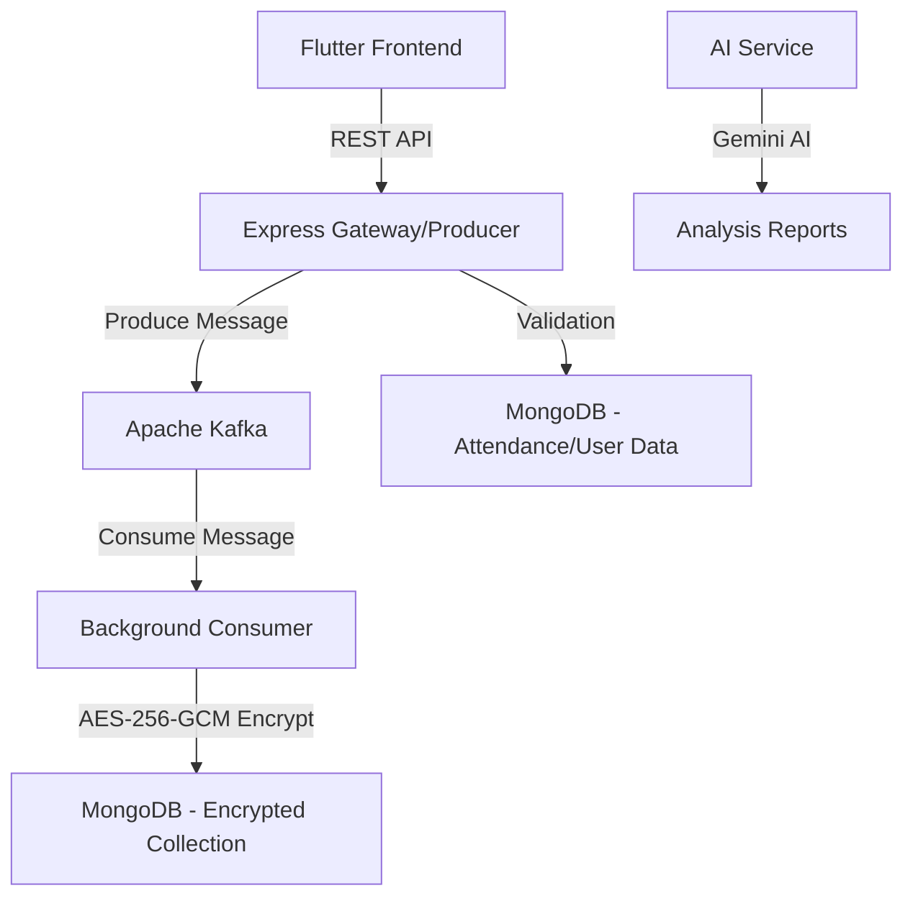

# Thub Prime: AI-Powered Feedback & Attendance Management System

Thub Prime is a high-performance, secure, and scalable educational platform designed to streamline student feedback and attendance management. It leverages a microservices-based architecture with event-driven communication to ensure reliability and data integrity.

## 🚀 Key Features

- **Asynchronous Feedback Pipeline**: Uses **Apache Kafka** to handle high-frequency feedback submissions without blocking the frontend.
- **End-to-End Encryption**: Every field in the feedback (Class ID, Rating, Comments, Student ID, Faculty ID) is encrypted using **AES-256-GCM** before persistent storage.
- **AI Feedback Analysis**: Deep analysis of student feedback using **Google Gemini AI** to generate constructive mentor performance reports and student engagement insights.
- **Attendance Validation**: Intelligent blocking system that ensures only students present in a class can submit feedback for that session.
- **Dockerized Infrastructure**: Seamless deployment using Docker Compose for Kafka, Zookeeper, and backend services.

---

## 🏗️ System Architecture



---

## 🛠️ Tech Stack

- **Frontend**: Flutter
- **Backend**: Node.js, Express.js
- **Messaging**: Apache Kafka (Kafkajs)
- **Database**: MongoDB (Mongoose)
- **AI**: Google Gemini Pro (Generative AI)
- **Security**: AES-256-GCM (Crypto)
- **DevOps**: Docker, Docker Compose

---

## 🚦 Getting Started

### Prerequisites

- Node.js (v16+)
- Docker & Docker Compose
- MongoDB Atlas or Local instance
- Google Gemini API Key

### Installation

1. **Clone the repository**:
   ```bash
   git clone https://github.com/jaswanth4237/Thub_Prime.git
   cd Thub_Prime
   ```

2. **Setup Credentials**:
   Create a `.env` file in the `backend` directory:
   ```env
   MONGO_URI=your_mongodb_uri
   SECRET_KEY=your_32_character_aes_key
   KAFKA_BROKERS=localhost:9092
   GEMINI_API_KEY=your_google_ai_key
   ```

3. **Install Dependencies**:
   ```bash
   cd backend
   npm install
   ```

---

## 🏃 Running the Application

### 1. Start Infrastructure (Kafka & Zookeeper)
```bash
docker compose -f docker-compose.kafka.yml up -d
```

### 2. Start Services

To run the complete system, you need to start three processes:

*   **API Gateway (Main Server)**:
    ```bash
    npm start
    ```
*   **Kafka Consumer (Encryption & Storage)**:
    ```bash
    npm run consumer
    ```
*   **AI Analysis Service**:
    ```bash
    npm run ai
    ```

---

## 🔐 Data Security

Thub Prime prioritizes student and mentor privacy. 

- **Probabilistic Encryption**: Every encryption uses a unique Initialization Vector (IV), ensuring the same data results in different ciphertexts.
- **Integrity**: Each record includes an **Auth Tag** (GCM) to prevent unauthorized tampering with the stored data.
- **Sensitive Fields**: Unlike traditional systems, Thub Prime stores *all* evaluative metrics in an encrypted blob, making the raw database unreadable without the master `SECRET_KEY`.

---

## 📋 API Endpoints (Quick Reference)

| Endpoint | Method | Description |
| :--- | :--- | :--- |
| `/attendance/add` | POST | Marks a student as present/absent. |
| `/feedback/add` | POST | Submits feedback to the Kafka pipeline. |
| `/analyze-feedback` | POST | Triggers AI analysis on a set of feedback. |
| `/user/add` | POST | Creates a new user/student profile. |
| `/class/add` | POST | Sets up a class session. |

---

## 👥 Contributors

- **VASAMSETTI JASWANTH** - Lead Developer

---

© 2026 Thub Prime - Empowering Education via AI.
