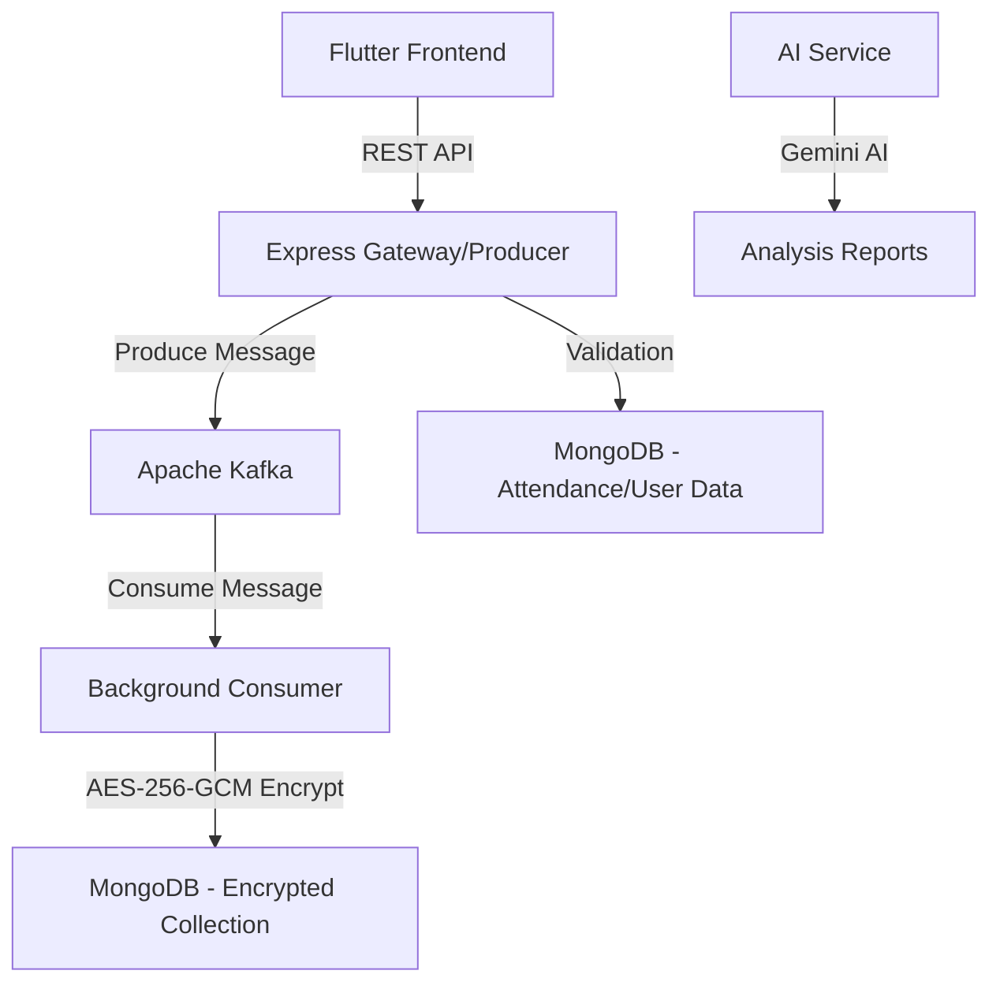

# THUB PRIME: AI-POWERED STUDENT SUCCESS

**Description**: A high-performance, secure, and scalable educational platform designed to streamline student feedback and attendance management. It leverages a microservices-based architecture with event-driven communication to ensure reliability, data integrity, and actionable AI-driven insights.

---

## 🚀 Functional Requirements

### Authentication & Access
- **Secure Login/Register**: JWT-based authentication for students and faculty.
- **Role-Based Access Control (RBAC)**: Distinct permissions for Admin, Faculty, and Students.
- **Identity Management**: Secure user profiling and class associations.

### Attendance Management
- **Real-Time Tracking**: Mark and track student presence in specific class sessions.
- **Intelligent Validation**: Automated system to ensure only students present in a class can submit feedback for that session.
- **Class Management**: Easily set up and manage class schedules and student lists.

### Asynchronous Feedback System
- **High-Throughput Pipeline**: Uses **Apache Kafka** to handle massive volumes of simultaneous feedback submissions without lag.
- **Reliable Delivery**: Ensures feedback is captured and processed even during peak traffic (e.g., end of a semester).

### AI Feedback Intelligence
- **Gemini AI Integration**: Automated analysis of student sentiments and comments using Google Gemini Pro.
- **Performance Reporting**: Generates constructive performance reports for mentors and engagement insights for administration.
- **Automated Summarization**: Distills hundreds of feedback entries into key actionable themes.

### Data Security & Privacy
- **End-to-End Encryption**: Every evaluative field is encrypted using **AES-256-GCM**.
- **Probabilistic Protection**: Unique Initialization Vectors (IV) for every record, ensuring the same data results in different ciphertexts.
- **Tamper Evidence**: Auth Tags (GCM) detect and prevent unauthorized data modifications.

---

## 🚦 Non-Functional Requirements

- **Latency**: Sub-second feedback submission response time via Kafka producers.
- **Scalability**: Capable of handling thousands of concurrent students across multiple departments.
- **Security**: Zero-knowledge storage for sensitive evaluative metrics; raw DB is unreadable without the master key.
- **Uptime**: High availability via containerized microservices (Docker).
- **Auditability**: Integrity-checked logs for all critical actions.

---

## ❓ Problem Statement

Traditional educational feedback systems often struggle with three core issues:
1.  **Submission Bottlenecks**: High-frequency feedback at the end of sessions often crashes monolithic backends.
2.  **Privacy Concerns**: Student comments and faculty ratings are often stored in plain text, risking exposure.
3.  **Data Fatigue**: Administrators lack the tools to manually analyze thousands of qualitative comments, leading to missed insights.

---

## 💡 Proposed Solution

**Thub Prime** addresses these challenges through a modern full-stack architecture:
-   **Flutter Frontend**: Provides a smooth, cross-platform experience for quick feedback entry.
-   **Event-Driven Backend**: A Node.js API Gateway produces messages to **Apache Kafka**, decoupling submission from processing.
-   **Security Layer**: A background consumer encrypts data using **AES-256-GCM** before it reaches the MongoDB database.
-   **AI Analysis Module**: An asynchronous service that leverages **Google Gemini AI** to transform raw data into professional insights, eliminating manual review fatigue.

---

## 🛠️ Technologies Used

-   **Frontend**: Flutter (Mobile/Web)
-   **Backend**: Node.js, Express.js
-   **Messaging**: Apache Kafka (Kafkajs)
-   **Database**: MongoDB (Mongoose)
-   **AI**: Google Gemini Pro (Generative AI)
-   **Security**: AES-256-GCM (Crypto)
-   **Infrastructure**: Docker, Docker Compose
-   **DevOps**: GitHub Actions

---

## 🏗️ System Architecture

---

## 📋 In-Scope / Out-Scope

### In-Scope
-   Student and Faculty authentication.
-   Attendance tracking and validation logic.
-   Asynchronous feedback submission pipeline.
-   End-to-end encryption of sensitive metrics.
-   AI-driven feedback analysis and report generation.
-   Docker orchestration for all services.

### Out-Scope
-   Live video lectures or streaming.
-   Integration with legacy LMS (Canvas/Moodle) - *planned for Future*.
-   Offline feedback submission without internet connectivity.
-   Peer-to-peer student messaging.

---

## � Future Enhancements
-   **LMS Integration**: Seamless sync with external learning management systems.
-   **Mobile Push Notifications**: Real-time alerts for attendance and feedback windows.
-   **Predictive Analytics**: Predicting student performance based on historical feedback trends.
-   **Advanced Dashboarding**: Interactive BI tools for administrative oversight.

---

## 🏁 Conclusion

**THUB PRIME** is a state-of-the-art solution that prioritizes security, scalability, and intelligence. By leveraging Kafka and Gemini AI, it transforms the traditional feedback loop into a powerful engine for educational improvement, ensuring that student voices are heard securely and faculty performance is evaluated fairly.

---

© 2026 Thub Prime - Empowering Education via AI.
